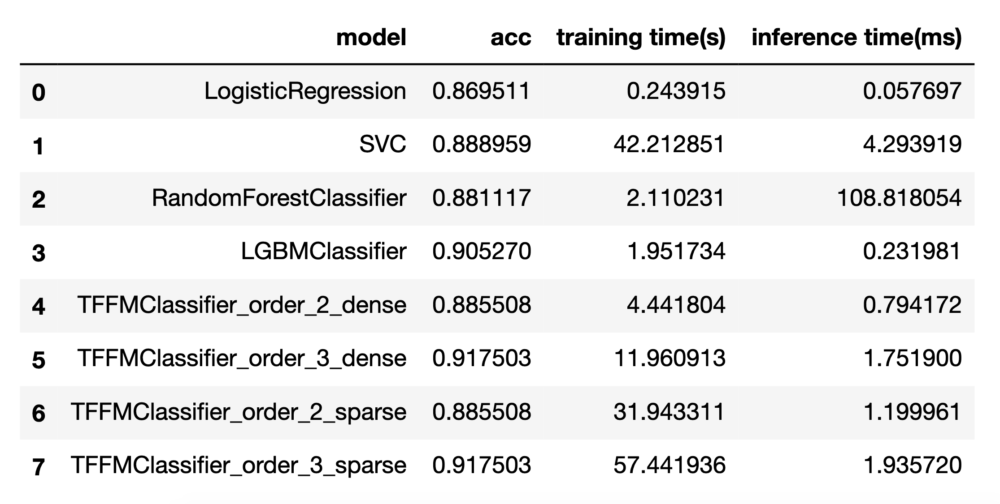
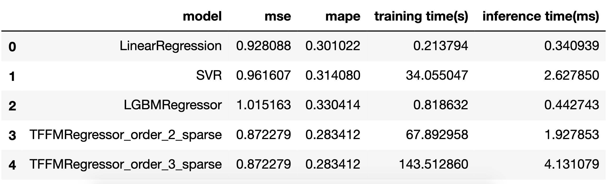

# Post

[Medium post](https://yulongtsai.medium.com/factorization-machine-implementation-analysis-c6c6dd5affa)

# Benchmark

## MNIST

</img>
</img>
</img>
</img>

## Movielens(ml-100k)

</img>

# Getting Start

1. Clone this repo and `tffm` (submodule)
2. Create an environment for `tffm` repectively by the `requirements` in the repo
3. run the test in `tffm` to make sure everything is fine.
4. [install sklearn nightly version](https://scikit-learn.org/stable/developers/advanced_installation.html) and jupyter notebook in your `tffm` environment.

5. add environment variable `RECSYS_IM_HOME` as the project-home in your computer.

6. Enjoy the ipynb :p
